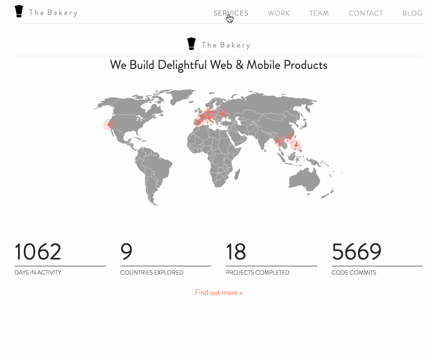
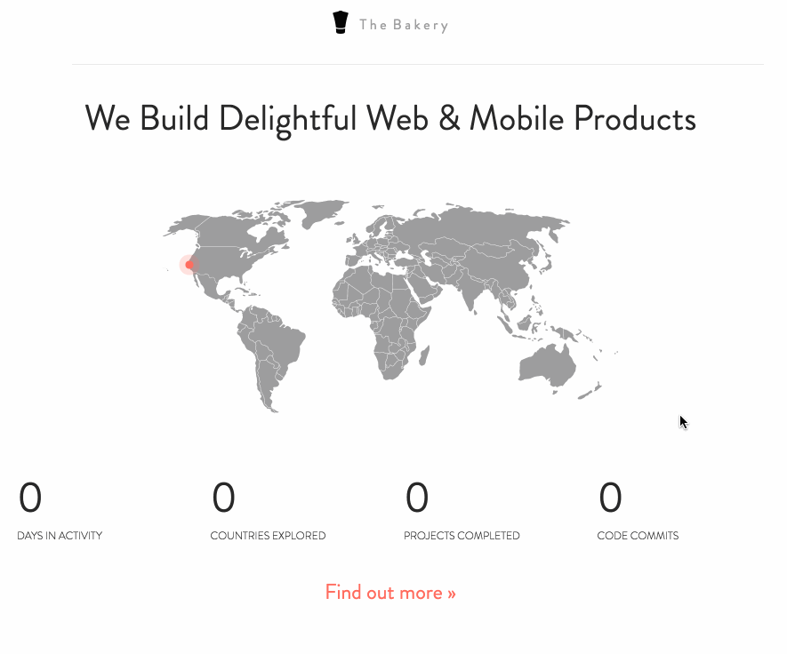

# Previously on Meteor

## Long time ago

- < 1.0: Wild Wild West
- 1.0: Let's stop changing things
- 1.1: Windows
- 1.2.x: ES2015, Angular, Reactm, Crosswalk on Android

---

## 1.3

- ES2015 Modules
- NPM packages
- Testing
- Cordova:
  - better code download
  - WKWebView

## 1.3 +

- Fresh Mongo and Node
- NPM everywhere


## Hands on


```bash
git checkout -b meteor13
meteor update
```



### Almost there



# Superbock time!


# Or ... Make controllers great again

# NPM in the house

```bash
npm init

npm install fontfaceobserver --save
```
[Font Observer](https://github.com/bramstein/fontfaceobserver)

# ECMAScript2015

```meteor add ecmascript```


## Current setup:


```javascript
// app controller

AppController = RouteController.extend({
  layoutTemplate: 'appLayout'
});

AppController.events({

});
```

### And then other controllers

```javascript
/* globals: AppController */ // <- yup 

HomeController = AppController.extend({
  layoutTemplate: 'homeLayout',
  data: {

  },
  onAfterAction : function(){
    // load images

    function preload(images) {
      $(images).each(function(){
        $('')[0].src = this;
      });
    }

    var images = [
      '/images/icons/service-icons-2.png',
      '/images/mark.jpg',
      '/images/philip.jpg',
      '/images/dino.jpg',
      '/images/work/y5/icon-orange.png',
      '/images/work/techberlin/logo.svg',
      '/images/work/openmic/icon.png',
      '/images/work/meteorday/icon-red.png'
    ];

    preload(images);
  }
});
```

## Challenge

- track font loading for every page
- bonus for not having to wrap a perfectly normal NPM package into Meteor package
- make app controller reusable through import

```javascript
// controllers/app.js

import FontFaceObserver from 'fontfaceobserver';
import { ReactiveVar } from 'meteor/reactive-var';

const fontsLoaded = new ReactiveVar(false);
const fontsToLoad = [
  new FontFaceObserver('Futura-Light'),
  new FontFaceObserver('Brandon'),
];

Promise.all(fontsToLoad.map(f => f.load())).then(function () {
  fontsLoaded.set(true);
});

const AppController = RouteController.extend({
  layoutTemplate: 'appLayout',
  
  onBeforeAction() {
    if (fontsLoaded.get()) {
      this.next();
    } else {
      this.render('loading');
    }
  }
});

export default AppController;

```

### And then back home ...

```javascript
import AppController from './app'; // <- now we know where this comes from

HomeController = AppController.extend({
  onAfterAction() {
    // preload images
    [
      '/images/icons/service-icons-2.png',
      '/images/mark.jpg',
      '/images/philip.jpg',
      '/images/work/y5/icon-orange.png',
      '/images/work/techberlin/logo.svg',
      '/images/work/openmic/icon.png',
      '/images/work/meteorday/icon-red.png'
    ].forEach(img => {
      $('')[0].src = img;
    });
  }
});
```

# Mission accomplished

- push to prod (mup deploy)
- !! set node version to 0.10.43
- mup setup && mup deploy

# Conclusion + Q&A

- it sort of works
- progressive step-by-step migration is an option
